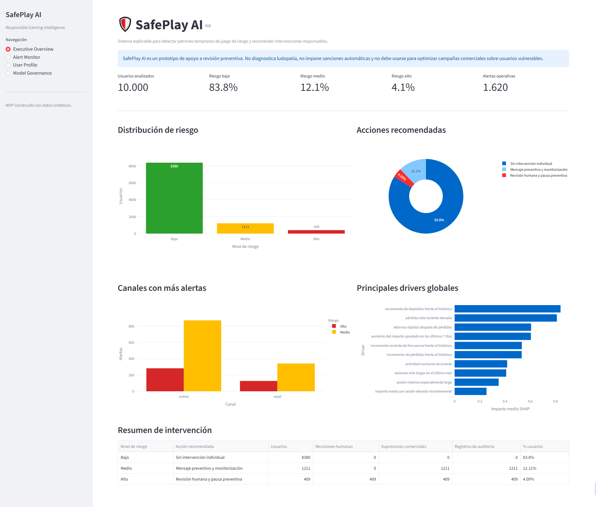
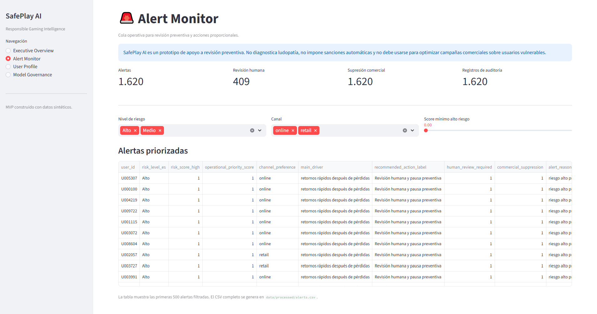
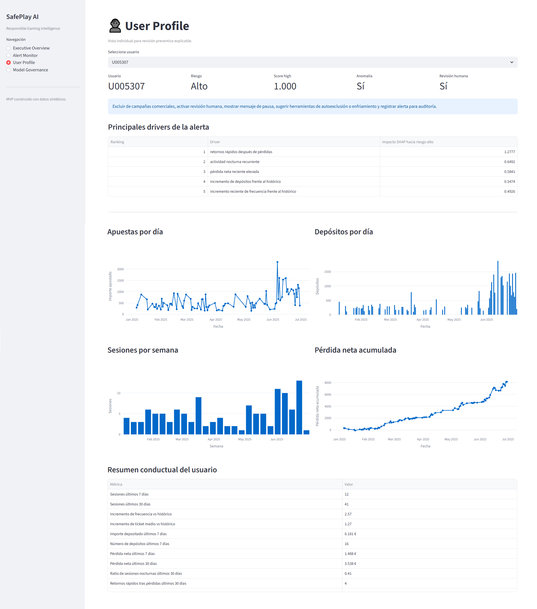
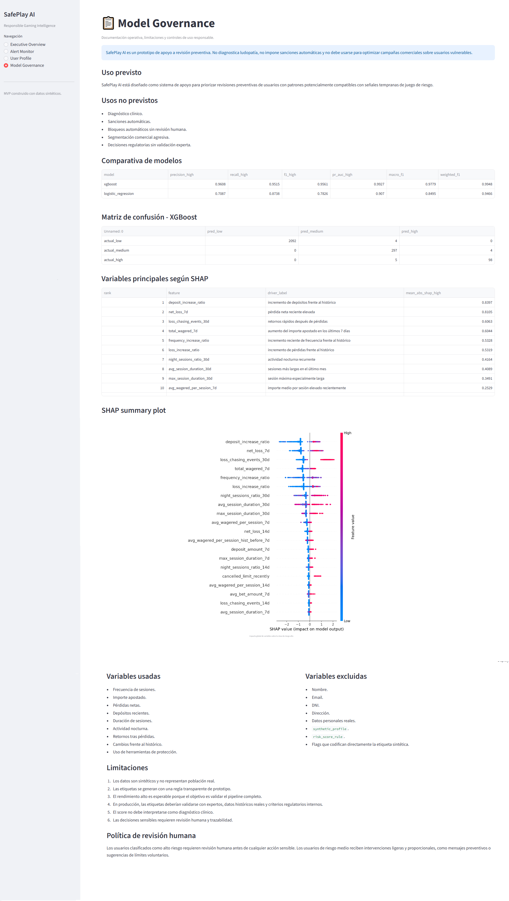

# SafePlay AI

SafePlay AI es un prototipo de machine learning explicable para detectar patrones tempranos de juego de riesgo en usuarios de plataformas de gaming.

El sistema utiliza datos sintéticos de sesiones, depósitos y comportamiento temporal para generar un score de riesgo, explicar los principales factores detrás de cada alerta y recomendar intervenciones responsables.

> Este proyecto no diagnostica ludopatía, no automatiza sanciones y no debe utilizarse para maximizar el gasto de usuarios vulnerables. Su objetivo es apoyar procesos de revisión preventiva con trazabilidad, explicabilidad y supervisión humana.

---

## Objetivo

Ayudar a priorizar revisiones preventivas de usuarios que muestran señales conductuales compatibles con posibles patrones de riesgo, como:

* aumento brusco de frecuencia de juego;
* incremento reciente de depósitos;
* sesiones largas o recurrentes;
* actividad nocturna;
* pérdidas concentradas en pocos días;
* retornos rápidos después de pérdidas;
* cancelación reciente de límites.

SafePlay AI no toma decisiones automáticas. Genera alertas explicables para que un equipo responsable pueda revisar los casos de forma proporcional.

---

## Componentes del proyecto

El MVP incluye:

1. Generación de datos sintéticos.
2. Feature engineering temporal.
3. Clasificación supervisada de riesgo.
4. Detección no supervisada de anomalías.
5. Explicabilidad con SHAP.
6. Reglas de intervención responsable.
7. Dashboard operativo en Streamlit.
8. Documentación de gobernanza y limitaciones.

---

## Arquitectura del pipeline

```text
users.csv
sessions.csv
        ↓
build_features.py
        ↓
user_features.csv
        ↓
train_model.py
        ↓
risk_model.pkl
predictions.csv
        ↓
explain_model.py
        ↓
top_drivers.csv
shap_global_importance_high.csv
        ↓
recommend_intervention.py
        ↓
alerts.csv
intervention_recommendations.csv
        ↓
streamlit_app.py
```

---

## Estructura del repositorio

```text
safeplay-ai/
│
├── app/
│   └── streamlit_app.py
│
├── data/
│   ├── processed/
│   └── synthetic/
│
├── models/
│   ├── risk_model.pkl
│   ├── preprocessor.pkl
│   ├── isolation_forest.pkl
│   └── label_mapping.json
│
├── reports/
│   ├── model_comparison.csv
│   ├── metrics.json
│   ├── shap_global_importance_high.csv
│   ├── shap_summary_high.png
│   ├── intervention_summary.csv
│   ├── model_card.md
│   ├── responsible_ai_assessment.md
│   └── business_case.md
│
├── src/
│   ├── generate_data.py
│   ├── build_features.py
│   ├── train_model.py
│   ├── explain_model.py
│   └── recommend_intervention.py
│
├── README.md
└── requirements.txt
```

---

## Dataset sintético

El proyecto genera datos completamente sintéticos. No se utilizan nombres, DNI, emails, direcciones ni información personal real.

### `users.csv`

Una fila por usuario.

Campos principales:

* `user_id`
* `age_band`
* `province`
* `registration_date`
* `channel_preference`
* `limit_configured`
* `marketing_opt_in`
* `self_excluded`

### `sessions.csv`

Una fila por sesión de juego.

Campos principales:

* `session_id`
* `user_id`
* `session_start`
* `channel`
* `product_type`
* `session_duration_min`
* `amount_wagered`
* `amount_won`
* `net_loss`
* `num_bets`
* `avg_bet_amount`
* `deposit_amount`
* `deposit_count`
* `night_session`
* `after_loss_return`

---

## Perfiles simulados

La simulación genera tres tipos de comportamiento:

### Bajo riesgo

Usuarios con actividad ocasional, importes bajos, sesiones cortas y pocos cambios recientes frente a su histórico.

### Riesgo medio

Usuarios con mayor frecuencia, aumento reciente del gasto, algunos depósitos recurrentes y señales tempranas que justifican monitorización preventiva.

### Alto riesgo

Usuarios con sesiones frecuentes, depósitos crecientes, actividad nocturna, pérdidas recientes, sesiones largas y retornos rápidos después de pérdidas.

La distribución objetivo del MVP es aproximadamente:

```text
Bajo riesgo:   80-85%
Riesgo medio: 10-15%
Alto riesgo:   3-5%
```

---

## Feature engineering

El sistema construye variables agregadas a nivel usuario usando ventanas temporales.

Variables de frecuencia:

* `sessions_7d`
* `sessions_14d`
* `sessions_30d`
* `active_days_30d`
* `frequency_increase_ratio`
* `days_since_last_session`

Variables monetarias:

* `total_wagered_7d`
* `total_wagered_30d`
* `net_loss_7d`
* `net_loss_30d`
* `avg_bet_amount_30d`
* `stake_increase_ratio`
* `deposit_amount_7d`
* `deposit_count_7d`
* `deposit_increase_ratio`

Variables de comportamiento:

* `avg_session_duration_30d`
* `max_session_duration_30d`
* `night_sessions_ratio_30d`
* `loss_chasing_events_30d`
* `product_switch_count_30d`
* `channel_switch_count_30d`

Variables de protección:

* `limit_configured`
* `cancelled_limit_recently`
* `self_exclusion_attempt`
* `cooling_off_used`

---

## Etiquetado sintético

Como los datos son sintéticos, las etiquetas se generan mediante una regla transparente basada en señales conductuales.

El score sintético considera:

* crecimiento de pérdidas;
* crecimiento de frecuencia;
* crecimiento de depósitos;
* retornos rápidos después de pérdidas;
* actividad nocturna;
* sesiones largas;
* cancelación reciente de límites.

Las etiquetas resultantes son:

```text
low
medium
high
```

Estas etiquetas sirven para construir un prototipo demostrativo. En producción, deberían validarse con expertos, datos históricos reales, criterios regulatorios internos y procesos de revisión humana.

---

## Modelos

El proyecto compara tres enfoques:

### Logistic Regression

Modelo baseline interpretable para comparar contra modelos más complejos.

### XGBoost

Modelo principal supervisado, seleccionado por su capacidad para capturar relaciones no lineales entre señales temporales y riesgo.

### Isolation Forest

Capa no supervisada para identificar usuarios con patrones atípicos, incluso cuando no encajan claramente en la etiqueta sintética.

---

## Métricas

El proyecto prioriza métricas relevantes para responsible gaming:

* recall en clase de alto riesgo;
* precision en clase de alto riesgo;
* F1-score en clase de alto riesgo;
* PR-AUC en clase de alto riesgo;
* matriz de confusión.

La métrica más importante es el recall en alto riesgo, porque el objetivo es reducir falsos negativos en usuarios que podrían requerir revisión preventiva. Al mismo tiempo, se monitoriza precision para evitar saturar al equipo de revisión con demasiados falsos positivos.

---

## Resultados del MVP

Con 10.000 usuarios sintéticos, el pipeline genera una distribución aproximada de:

```text
Bajo riesgo:   83.8%
Riesgo medio: 12.1%
Alto riesgo:   4.1%
```

La comparativa de modelos muestra que XGBoost supera al baseline en la clase de alto riesgo.

Resultados obtenidos en el conjunto de test:

```text
Modelo: XGBoost
Precision high: 0.9608
Recall high:    0.9515
F1 high:        0.9561
PR-AUC high:    0.9927
```

Dado que las etiquetas son sintéticas, estos resultados no deben interpretarse como evidencia de rendimiento clínico o regulatorio. El objetivo del MVP es demostrar el pipeline completo de datos, modelado, explicabilidad, intervención y gobernanza.

---

## Explicabilidad

SafePlay AI utiliza SHAP para explicar:

1. drivers globales del modelo;
2. drivers individuales por usuario alertado.

Ejemplos de drivers globales para riesgo alto:

* incremento de depósitos frente al histórico;
* pérdida neta reciente elevada;
* retornos rápidos después de pérdidas;
* aumento del importe apostado en los últimos 7 días;
* incremento reciente de frecuencia frente al histórico;
* actividad nocturna recurrente;
* sesiones más largas.

Ejemplo de explicación individual:

```text
Usuario: U005307
Riesgo: Alto
Drivers principales:
1. retornos rápidos después de pérdidas
2. actividad nocturna recurrente
3. pérdida neta reciente elevada
4. incremento de depósitos frente al histórico
5. incremento reciente de frecuencia frente al histórico
```

---

## Dashboard Preview

### Executive Overview



### Alert Monitor



### User Profile



### Model Governance



---

## Instalación

Crear entorno virtual:

```bash
python -m venv .venv
```

Activar entorno en Windows:

```bash
.venv\Scripts\activate
```

Activar entorno en macOS/Linux:

```bash
source .venv/bin/activate
```

Instalar dependencias:

```bash
pip install -r requirements.txt
```

---

## Ejecución del pipeline

Ejecutar desde la raíz del proyecto:

```bash
python src/generate_data.py
python src/build_features.py
python src/train_model.py
python src/explain_model.py
python src/recommend_intervention.py
```

Lanzar el dashboard:

```bash
streamlit run app/streamlit_app.py
```

---

## Principales outputs

```text
data/synthetic/users.csv
data/synthetic/sessions.csv
data/processed/user_features.csv
data/processed/predictions.csv
data/processed/top_drivers.csv
data/processed/alerts.csv
data/processed/intervention_recommendations.csv
models/risk_model.pkl
reports/model_comparison.csv
reports/shap_summary_high.png
reports/intervention_summary.csv
```

---

## Gobernanza y limitaciones

SafePlay AI es un MVP construido con datos sintéticos. Sus principales limitaciones son:

1. No utiliza datos reales.
2. Las etiquetas se generan mediante reglas sintéticas.
3. El rendimiento del modelo puede ser alto por la naturaleza controlada de los datos.
4. No identifica ni diagnostica adicción.
5. No debe utilizarse para tomar decisiones automáticas sensibles.
6. Requiere validación con expertos antes de cualquier uso real.

Medidas de mitigación incluidas:

* revisión humana para alertas de alto riesgo;
* explicabilidad individual;
* documentación de variables usadas y excluidas;
* exclusión comercial para usuarios de riesgo medio y alto;
* registro de alertas para auditoría;
* separación clara entre score predictivo e intervención responsable.

---

## Resumen del proyecto

SafePlay AI es un prototipo de IA responsable aplicado al sector gaming. El objetivo es detectar patrones tempranos de juego de riesgo usando datos de comportamiento, como frecuencia de sesiones, depósitos, pérdidas, actividad nocturna y cambios frente al histórico del usuario.

El sistema genera un score de riesgo, explica cada alerta con SHAP y recomienda intervenciones proporcionales, como mensajes preventivos, sugerencia de límites o revisión humana.

Lo importante es que no es una caja negra ni un sistema de decisión automática. Está diseñado con una capa de gobernanza, documentación de limitaciones y enfoque de protección del usuario.

---

## Stack técnico

* Python
* Pandas
* NumPy
* Scikit-learn
* XGBoost
* SHAP
* Plotly
* Streamlit

---

## Próximas mejoras

* Validación con expertos de responsible gaming.
* Calibración de probabilidades.
* Seguimiento temporal de alertas revisadas.
* Integración con MLflow.
* Tests unitarios para generación de features.
* Data validation con Great Expectations.
* Dockerización del dashboard.
* Simulación de feedback de revisores humanos.
* Monitorización de drift de datos y modelo.
